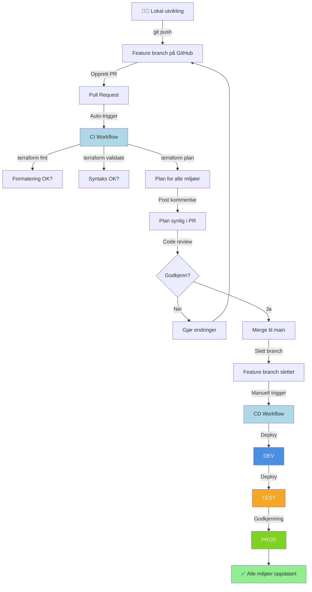

# Infrastructure as Code med Terraform og GitHub Actions

Dette prosjektet demonstrerer moderne Infrastructure as Code (IaC) praksis ved bruk av Terraform, GitHub Actions, og Microsoft Azure. Du vil lære å implementere "build once, deploy many" prinsippet kombinert med trunk-based development.

---

## 🎯 Konsepter og Prinsipper

### Infrastructure as Code (IaC)

### Build Once, Deploy Many

**Tradisjonell applikasjonsutvikling:**
```
Kildekode → Kompiler → myapp.jar → Deploy til dev, test, prod
```

**Infrastructure as Code:**
```
Terraform-kode → Valider → Samme .tf filer → Deploy til dev, test, prod
```

**Nøkkelpunkt:**
- 🔨 **"Once"** = Koden valideres én gang i CI-pipeline
- 🚀 **"Many"** = Samme kode deployes til flere miljøer med forskjellige variabler
- 📦 **"Artefakt"** = Terraform-koden i main branch (ikke en kompilert fil!)

**Hva varierer mellom miljøer?**
- Miljønavn (dev, test, prod)
- Størrelse/tier (Standard vs Premium)
- Tags og metadata

**Hva er likt?**
- Alle .tf filer (infrastrukturens struktur)
- Terraform-versjon
- Provider-versjoner

### Trunk-Based Development

**Hva er det?**
En Git-arbeidsflyt hvor alle jobber mot en felles main branch med korte, kortlevde feature branches.

**Prinsipper:**
- 🌳 **Main branch** er alltid deploybar ("trunk")
- 🌿 **Feature branches** er korte (timer/dager, ikke uker)
- 🔀 **Merge ofte** til main
- ✅ **CI validerer** alle endringer før merge
- 🗑️ **Slett branches** etter merge

**Arbeidsflyt:**
```
main → feature branch → PR → CI validerer → Merge → Slett branch → repeat
```

---

## 📁 Prosjektstruktur

```
terraform-demo/
├── terraform/                           # Terraform-kode (ARTEFAKTET)
│   ├── main.tf                         # Hovedressurser (RG + Storage)
│   ├── variables.tf                    # Input-variabler
│   ├── outputs.tf                      # Output-verdier
│   ├── versions.tf                     # Provider-konfigurasjoner
│   └── backend.tf                      # State backend konfigurasjon
├── shared/
│   └── backend.hcl                     # Backend-verdier (ikke committet)
├── .github/
│   └── workflows/
│       ├── terraform-ci.yml            # Continuous Integration
│       └── terraform-cd.yml            # Continuous Deployment
├── .gitignore                          # Hva Git skal ignorere
└── README.md                           # Denne filen
```

### Hva er hva?

**terraform/** - Dette er "artefaktet" som deployes til alle miljøer
- `main.tf` - Definerer hva som skal opprettes (Resource Group + Storage Account)
- `variables.tf` - Definerer hva som KAN varieres mellom miljøer
- `outputs.tf` - Hva Terraform skal vise etter deployment
- `backend.tf` - Hvor Terraform lagrer state-filer

**shared/** - Konfigurasjon som ikke committes til Git
- `backend.hcl` - Dine personlige backend-verdier (storage account for state)

**.github/workflows/** - GitHub Actions workflows
- `terraform-ci.yml` - Validerer kode på Pull Requests (automatisk)
- `terraform-cd.yml` - Deployer infrastruktur til Azure (manuell trigger)

---

## 🔧 Forutsetninger

### 1. Azure Ressurser (allerede på plass)

Du har allerede følgende fra tidligere øvinger:

- ✅ **Azure Subscription** med nødvendige rettigheter
- ✅ **Service Principal** med Federated Credentials
- ✅ **Storage Account** for Terraform state-filer
- ✅ **Container** i Storage Account (typisk "tfstate")
- ✅ **Key Vault** (hvis du bruker secrets)


### Steg 2: Konfigurer backend

Opprett `shared/backend.hcl` med dine verdier:

```hcl
# shared/backend.hcl
resource_group_name  = "<DIN RESOURCE GROUP>"
storage_account_name = "<DIN STORAGE ACCOUNT"
container_name       = "<DIN CONTAINER NAME>"
```

### Steg 3: Test Terraform lokalt

```bash
# Logg inn til Azure i VS Code
az login
az account set --subscription "<DIN_SUBSCRIPTION_ID>"

# Initialiser Terraform
cd terraform
terraform init \
  -backend-config=../shared/backend.hcl \
  -backend-config="key=dev.tfstate"

# Test at det fungerer
terraform validate
terraform plan \
  -var="environment=dev" \
  -var="location=norwayeast" \
  -var="project_name=demo" \
  -var="replication_type=LRS"
```

Hvis alt fungerer, er du klar for å sette opp GitHub Actions!


### Steg 4: Opprett workflows i Github.com

Se video

---

## 💻 Lokal utvikling

### Arbeidsflyt for å gjøre endringer

```bash
# 1. Sørg for at main er oppdatert
git checkout main
git pull origin main

# 2. Opprett feature branch
git checkout -b feature/add-tags

# 3. Gjør endringer i terraform/
nano terraform/main.tf

# 4. Test lokalt
cd terraform
terraform fmt              # Formater kode
terraform validate         # Valider syntaks
terraform plan \
  -var="environment=dev" \
  -var="location=norwayeast" \
  -var="project_name=demo" \

# 5. Commit og push
git add terraform/main.tf
git commit -m "Add tags to storage account"
git push origin feature/add-tags
```

### Lokale verktøy-kommandoer

```bash
# Azure CLI
az login                           # Logg inn
az account show                    # Se aktiv subscription
az account list                    # Liste subscriptions

# Terraform
terraform init                     # Initialiser (første gang / nye providers)
terraform fmt                      # Formater kode automatisk
terraform fmt -check               # Sjekk formatering uten å endre
terraform validate                 # Valider syntaks
terraform plan                     # Se hva som vil skje
terraform apply                    # Gjør endringer (FORSIKTIG!)
terraform output                   # Se outputs fra siste apply
terraform show                     # Se current state
terraform state list               # Liste ressurser i state

# Git
git status                         # Se endringer
git branch                         # Liste branches
git branch -a                      # Liste alle branches (inkl. remote)
git fetch --prune                  # Oppdater remote refs
```

---

## 🔄 CI/CD Workflow

### Oversikt



### CI Workflow (Continuous Integration)

**Trigger:** Når du oppretter eller oppdaterer en Pull Request

**Hva skjer:**

1. **Validering**
   - `terraform fmt -check` - Sjekker at koden er riktig formatert
   - `terraform validate` - Sjekker at syntaksen er korrekt
   - `terraform init` - Initialiserer Terraform

2. **Planning (parallelt for alle miljøer)**
   - `terraform plan` for dev
   - `terraform plan` for test
   - `terraform plan` for prod

3. **Resultat**
   - Plan-output postes som kommentar på PR
   - Du ser nøyaktig hva som vil skje i hvert miljø
   - Reviewer kan godkjenne basert på plan

**Hvor ser du resultatet?**
- GitHub → Pull Requests → Din PR → Conversations
- Kommentarer fra "github-actions bot"
- Actions → Workflow run → Logs

**Eksempel på plan-output:**
```terraform
Terraform Plan for `dev` 📋

▶ Show Plan

Terraform will perform the following actions:

  # azurerm_resource_group.main will be created
  + resource "azurerm_resource_group" "main" {
      + id       = (known after apply)
      + location = "norwayeast"
      + name     = "rg-demo-dev"
    }

Plan: 2 to add, 0 to change, 0 to destroy.
```

### CD Workflow (Continuous Deployment)

**Trigger:** Manuell trigger via GitHub Actions UI

**Hvordan trigge:**

1. Gå til **Actions** tab
2. Velg **"Terraform CD"** workflow (venstre sidebar)
3. Klikk **"Run workflow"** (høyre side)
4. Velg:
   - **Branch:** main (vanligvis)
   - **Environment:** dev / test / prod / all
   - **Confirm:** Skriv "deploy"
5. Klikk **"Run workflow"**

**Hva skjer:**

1. **Validation**
   - Sjekker at du skrev "deploy" (sikkerhet)
   - Viser hva som skal deployes

2. **Deployment (sekvensielt)**
   - Deploy til valgte miljøer i rekkefølge
   - Dev → Test → Prod (hvis "all" valgt)
   - Stopper hvis ett miljø feiler

3. **Prod godkjenning**
   - Når prod skal deployes, venter workflowen
   - Du får notifikasjon
   - Må klikke "Approve and deploy"

4. **Resultat**
   - Outputs fra hvert miljø vises i Summary
   - Infrastruktur er opprettet/oppdatert i Azure

**Deployment-alternativer:**

| Valg | Hva skjer |
|------|-----------|
| `dev` | Deploy kun til DEV |
| `test` | Deploy kun til TEST |
| `prod` | Deploy kun til PROD (krever godkjenning) |
| `dev-test` | Deploy til DEV, deretter TEST |
| `all` | Deploy til alle tre i sekvens |

---

## 📝 Praktiske eksempler

### Eksempel 1: Første deployment

**Scenario:** Du skal deploye infrastrukturen for første gang.

```bash
# 1. Verifiser at all setup er OK
git status
git branch  # Skal være på main

# 2. GitHub Actions → Terraform CD → Run workflow
# Velg: environment = "all", confirm = "deploy"
# → Deploy til dev
# → Deploy til test  
# → Venter på prod godkjenning
# → Godkjenn i GitHub UI
# → Deploy til prod

# 3. Verifiser i Azure Portal
# Du skal nå se:
# - rg-demo-dev med stdemodev<random>
# - rg-demo-test med stdemotest<random>
# - rg-demo-prod med stdemoprod<random>
```

### Eksempel 2: Legge til tags på ressurser

**Scenario:** Kunden vil ha tags for kostnadsoppfølging.

```bash
# 1. Opprett feature branch
git checkout main
git pull
git checkout -b feature/add-cost-tags

# 2. Rediger terraform/main.tf
nano terraform/main.tf

# Legg til i resource_group og storage_account:
tags = {
  Environment = var.environment
  ManagedBy   = "Terraform"
  CostCenter  = "IT"
  Owner       = "Platform Team"
}

# 3. Test lokalt
cd terraform
terraform fmt
terraform validate
terraform plan -var="environment=dev" ...

# Output viser:
# ~ resource "azurerm_resource_group" "main" {
#     ~ tags = {
#         + "CostCenter" = "IT"
#         + "Owner"      = "Platform Team"
#       }
# }

# 4. Commit og push
git add terraform/main.tf
git commit -m "Add cost tracking tags to all resources"
git push origin feature/add-cost-tags

# 5. Opprett Pull Request på GitHub
# - CI kjører automatisk
# - Se plan i PR-kommentarer
# - Plan viser "1 to change" for hver ressurs
# - Request review (valgfritt)
# - Merge når godkjent

# 6. Deploy endringen
# GitHub Actions → Terraform CD → Run workflow
# environment = "all", confirm = "deploy"
# → Samme kode deployes til alle miljøer
# → Tags legges til på eksisterende ressurser
# → INGEN downtime! (update in-place)

# 7. Verifiser i Azure Portal
# Alle ressurser har nå tags
```

### Eksempel 3: Oppgradering av prod storage tier

**Scenario:** Prod trenger bedre ytelse - oppgrader til Premium tier.

```bash
# 1. Opprett feature branch
git checkout -b feature/upgrade-prod-tier

# 2. IKKE endre terraform/main.tf
# (koden skal være lik for alle miljøer!)

# 3. I stedet: endre workflow-filen
# Rediger .github/workflows/terraform-cd.yml
# Under deploy-prod job, endre:
# STORAGE_TIER: "Standard"  → "Premium"

# MEN VENT - dette er dårlig praksis! 
# Bedre løsning: Bruk en variabel-fil eller config

# Bedre tilnærming:
# I terraform/variables.tf: Legg til default per miljø
# Eller: Pass inn via workflow basert på environment

# 4. Opprett PR og merge

# 5. Deploy til prod
# GitHub Actions → Terraform CD → Run workflow
# environment = "prod", confirm = "deploy"
# → Terraform plan viser: storage account vil bli gjenskapt
# → Godkjenn deployment
# → VIKTIG: Dette kan gi downtime!

# 6. Alternativ: Bruk lifecycle rule for å unngå gjenskap
# I main.tf:
lifecycle {
  prevent_destroy = true
  ignore_changes = [account_tier]
}
```

### Eksempel 4: Feilretting - Dev deployment feilet

**Scenario:** Du deployet, men dev feilet med feilmelding.

```bash
# 1. Se feilen i GitHub Actions logs
# Actions → Workflow run → deploy-dev job → Terraform Apply step

# Eksempel feil:
# Error: storage account name must be unique globally
# Name: "stdemodev" is already taken

# 2. Fiks problemet
git checkout -b fix/storage-name-conflict

# Rediger terraform/main.tf:
resource "azurerm_storage_account" "main" {
  name = "st${var.project_name}${var.environment}${random_string.suffix.result}"
  # Legger til random suffix for uniqueness
}

# Legg til random_string resource:
resource "random_string" "suffix" {
  length  = 6
  special = false
  upper   = false
}

# 3. Test lokalt
terraform plan -var="environment=dev" ...
# Output: name = "stdemodev7x3k2a"  (unikt!)

# 4. Commit, push, PR, merge

# 5. Deploy på nytt
# GitHub Actions → Terraform CD → Run workflow
# environment = "dev", confirm = "deploy"
# → Nå fungerer det!
```

### Eksempel 5: Rollback til tidligere versjon

**Scenario:** Siste endring gjorde noe galt. Du vil deploye en tidligere versjon.

```bash
# 1. Finn riktig commit i Git history
git log --oneline
# abc1234 Add tags (← Vi vil tilbake til denne)
# def5678 Update tier (← Denne gjorde noe galt)

# 2. GitHub Actions → Terraform CD → Run workflow
# Branch: main
# Ref: abc1234  (commit SHA)
# Environment: prod
# Confirm: deploy

# Alternativ: Revert commit
git revert def5678
git push origin main
# → Så deploy main som normalt
```

---

## 🔍 Feilsøking

### Problem: CI workflow trigges ikke

**Symptom:** Du oppretter PR, men CI kjører ikke.

**Løsninger:**
1. **Sjekk path filter**
   ```yaml
   paths:
     - "course materials/.../terraform/**"
   ```
   Er endringene dine i denne pathen?

2. **Sjekk at workflow eksisterer på main**
   ```bash
   git checkout main
   ls .github/workflows/
   # Skal inneholde terraform-ci.yml
   ```

3. **Sjekk YAML syntaks**
   - GitHub → Actions → Se om det er syntax errors

### Problem: "Permission denied" ved Azure login

**Symptom:** 
```
Error: Failed to authenticate with Azure
```

**Løsninger:**
1. **Sjekk Secrets**
   - Settings → Secrets → AZURE_CLIENT_ID finnes?
   - Riktig Client ID?

2. **Sjekk Federated Credentials**
   - Azure Portal → App Registrations → Federated credentials
   - Subject matcher: `repo:<org>/<repo>:environment:dev`

3. **Sjekk Service Principal rettigheter**
   - Har den Contributor role på Subscription?

### Problem: Terraform plan viser "all resources will be created"

**Symptom:** Plan viser "2 to add" selv om ressursene finnes.

**Årsak:** State-filen matcher ikke faktisk tilstand.

**Løsninger:**
1. **Feil state-fil key**
   ```bash
   # Sjekk at key er riktig
   -backend-config="key=projects/storageaccount/dev/dev.tfstate"
   ```

2. **Manuelt importere eksisterende ressurser**
   ```bash
   terraform import azurerm_resource_group.main /subscriptions/.../resourceGroups/rg-demo-dev
   ```

3. **Start på nytt (siste utvei)**
   ```bash
   # Slett gamle ressurser i Azure Portal
   # Kjør terraform apply på nytt
   ```

### Problem: "Lock file is missing"

**Symptom:**
```
Error: Failed to read lock file
```

**Løsning:**
```bash
# Generer lock file lokalt
cd terraform
terraform init -backend=false

# Commit lock file
git add .terraform.lock.hcl
git commit -m "Add provider lock file"
git push
```

### Problem: Deployment stopper ved prod godkjenning

**Symptom:** Workflow venter i 30 min, deretter timeout.

**Løsning:**
1. **Gå til Actions**
2. **Klikk på kjørende workflow**
3. **Klikk "Review deployments"**
4. **Velg "production"**
5. **Klikk "Approve and deploy"**

### Problem: Environment variables er tomme i plan

**Symptom:**
```
PLAN:
(tom output)
```

**Løsning:**
```yaml
# Endre terraform_wrapper til true
- name: Setup Terraform
  uses: hashicorp/setup-terraform@v3
  with:
    terraform_wrapper: true  # ← VIKTIG
```

---

## ✅ Best Practices

### 1. Git Workflow

```bash
# ✅ DO: Korte, fokuserte branches
git checkout -b feature/add-tags

# ❌ DON'T: Brede, langlevde branches
git checkout -b refactor-everything
```

**Prinsipper:**
- En branch = en endring
- Merge ofte (dager, ikke uker)
- Slett branches etter merge
- Hold main branch ren og deploybar

### 2. Commit Messages

```bash
# ✅ DO: Beskrivende commits
git commit -m "Add cost center tags to storage accounts"

# ❌ DON'T: Vage commits
git commit -m "fix stuff"
```

**Format:**
```
<type>: <beskrivelse>

[valgfri lengre forklaring]

[valgfrie footer notes]
```

**Typer:**
- `feat:` Ny funksjonalitet
- `fix:` Bugfix
- `docs:` Dokumentasjon
- `refactor:` Kodeomstrukturering
- `test:` Testing
- `chore:` Vedlikehold

### 3. Terraform Code

```hcl
# ✅ DO: Bruk variabler
resource "azurerm_storage_account" "main" {
  name = "st${var.project_name}${var.environment}${random_string.suffix.result}"
  account_tier = var.storage_tier
}

# ❌ DON'T: Hardkod verdier
resource "azurerm_storage_account" "main" {
  name = "stdemodev123"
  account_tier = "Standard"
}
```

**Prinsipper:**
- DRY (Don't Repeat Yourself)
- Parametriser miljø-forskjeller
- Bruk meaningful variable names
- Kommenter kompleks logikk
- Konsistent naming convention

### 4. Pull Requests

```markdown
# ✅ DO: God PR beskrivelse
## Hva
Legger til cost center tags på alle ressurser

## Hvorfor
For å kunne spore kostnader per prosjekt

## Testing
- ✅ Testet lokalt med terraform plan
- ✅ Verifisert at tags legges til uten gjenskap av ressurser

## Reviewers
@teamlead
```

**Prinsipper:**
- Forklar hva og hvorfor
- Inkluder testing notes
- Hold PRs små (< 400 linjer)
- Request review når nødvendig
- Responder på feedback

### 5. Deployment

```bash
# ✅ DO: Progressiv deployment
# 1. Deploy til dev først
# 2. Test i dev
# 3. Deploy til test
# 4. Test i test
# 5. Deploy til prod (med godkjenning)

# ❌ DON'T: Deploy direkte til prod
# Spesielt ikke første gang!
```

**Prinsipper:**
- Test i dev først
- Verifiser i test
- Prod er siste (og har godkjenning)
- Samme kode til alle miljøer
- Dokumenter endringer

### 6. State Management

```bash
# ✅ DO: En state-fil per miljø
# dev.tfstate
# test.tfstate
# prod.tfstate

# ✅ DO: Remote backend
# I Azure Storage Account

# ❌ DON'T: Local state files
# terraform.tfstate (lokalt)

# ❌ DON'T: Delt state-fil
# shared.tfstate (for alle miljøer)
```

**Prinsipper:**
- Remote state alltid
- Separate state per miljø
- Aldri commit state-filer til Git
- State locking (automatisk med Azure)
- Backup av state (Azure Storage redundancy)

### 7. Secrets Handling

```yaml
# ✅ DO: GitHub Secrets
secrets:
  AZURE_CLIENT_ID: ${{ secrets.AZURE_CLIENT_ID }}

# ✅ DO: Azure Key Vault (for app secrets)
data "azurerm_key_vault_secret" "db_password" {
  name = "db-password"
  key_vault_id = data.azurerm_key_vault.main.id
}

# ❌ DON'T: Hardkod i kode
variable "password" {
  default = "SuperSecret123"  # ALDRI!
}

# ❌ DON'T: Commit secrets
# .env
# secrets.tfvars
```

**Prinsipper:**
- Aldri hardkod secrets
- Bruk GitHub Secrets for CI/CD
- Bruk Key Vault for app secrets
- Aldri commit secrets til Git
- Rotate secrets regelmessig

---

## 🎓 Læringsmål

Etter å ha fullført denne oppgaven skal du kunne:

**Konseptuell forståelse:**
- ✅ Forklare hva Infrastructure as Code er og hvorfor det er nyttig
- ✅ Beskrive "build once, deploy many" prinsippet
- ✅ Forstå forskjellen mellom IaC og tradisjonell applikasjonsutvikling
- ✅ Forklare trunk-based development workflow

**Tekniske ferdigheter:**
- ✅ Skrive Terraform kode for Azure ressurser
- ✅ Bruke Terraform variabler for miljø-spesifikk konfigurasjon
- ✅ Sette opp og bruke remote state backend
- ✅ Lage GitHub Actions workflows for CI/CD
- ✅ Bruke Federated Credentials for sikker autentisering
- ✅ Trigger og overvåke deployments

**Best Practices:**
- ✅ Følge Git workflow for samarbeid
- ✅ Skrive gode commit messages og PR beskrivelser
- ✅ Håndtere secrets på en sikker måte
- ✅ Implementere progressive deployments
- ✅ Dokumentere infrastruktur som kode

---

## 📚 Ressurser

### Terraform
- [Terraform Documentation](https://www.terraform.io/docs)
- [Terraform Azure Provider](https://registry.terraform.io/providers/hashicorp/azurerm/latest/docs)
- [Terraform Best Practices](https://www.terraform-best-practices.com/)

### GitHub Actions
- [GitHub Actions Documentation](https://docs.github.com/en/actions)
- [Workflow Syntax](https://docs.github.com/en/actions/reference/workflow-syntax-for-github-actions)
- [Azure Login Action](https://github.com/Azure/login)

### Azure
- [Azure Documentation](https://docs.microsoft.com/en-us/azure/)
- [Azure CLI Reference](https://docs.microsoft.com/en-us/cli/azure/)
- [Federated Credentials](https://docs.microsoft.com/en-us/azure/active-directory/develop/workload-identity-federation)

---

## 🤝 Hjelp og Support

**Hvis du står fast:**

1. **Sjekk feilmeldingen nøye** - Den forteller ofte hva som er galt
2. **Se i GitHub Actions logs** - Detaljert output av hva som skjedde
3. **Bruk feilsøkingsseksjonen** - Vanlige problemer og løsninger
4. **Søk i Terraform/Azure dokumentasjon** - Ofte gode eksempler
5. **Spør medstudenter** - Sannsynligvis har noen møtt samme problem
6. **Spør foreleser/lab-assistent** - Vi er her for å hjelpe!

**Nyttige debugging-kommandoer:**

```bash
# Git
git status
git log --oneline
git branch -a

# Terraform
terraform validate
terraform fmt -check
terraform plan -out=plan.out
terraform show plan.out

# Azure CLI
az account show
az group list
az storage account list
```

---

## 🎉 Suksesskriterier

Du har lykkes når:

- ✅ CI workflow validerer automatisk på alle PRs
- ✅ CD workflow kan deploye til valgte miljøer manuelt
- ✅ Dev, test og prod har identisk infrastruktur (bare forskjellig konfigurasjon)
- ✅ Du kan gjøre en endring fra lokal maskin til prod på under 30 minutter
- ✅ All infrastruktur er versionert i Git
- ✅ Ingen manuelle klikkoperasjoner i Azure Portal er nødvendig
- ✅ Du føler deg komfortabel med hele flyten

**Lykke til!** 🚀